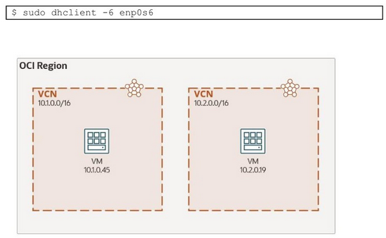

# Lab 04: Virtual Cloud Network (VCN): Configure IPv6 on two VCNs and communicate them with ICMPv6

## Overview

In this lab, you will interconnect two VCNs in the same region. The Dynamic Routing Gateway (DRG) will be used as an attachment to both VCNs.

The objective is to privately communicate two compute instances, one in each VCN, with each other via the DRG with IPv6. Ping6 will be used for testing the success of the lab.

For this, the VCNs, subnets, and compute instances' VNICs need to be enabled for IPv6 addressing. For the VMs the VM.Standard.A1.Flex shape will be used.

The compute instances' internal OS firewall needs to be configured for IPv6. After enabling IPv6 on all OCI components that require it, you will SSH to both VMs and run the following command:



## Set up environment: Create VCNs and instances

You will first build two VCNs in the same region and in the same compartment, with a public subnet in each VCN, with access to the internet. It also requires two compute instances, one in each subnet:

- VCN1:
  - Names: __IAD-NP-LAB04-VCN-01__
  - CIDR Block: __10.1.0.0/16__
  - Public subnet
  - CIDR Block: __10.1.0.0/24__
- VCN2:
  - Names: __IAD-NP-LAB04-VCN-02__
  - CIDR Block: __10.2.0.0/16__
  - Public subnet
  - CIDR Block: __10.2.0.0/24__
- Two Compute Instances:
  - Name: __IAD-NP-LAB04-VM-01__, __IAD-NP-LAB04-VM-02__
  - Image: Oracle Linux 8
  - Shape: __VM.Standard.A1.Flex__ with 1 OCPU and 6 GB

You'll set these up, then proceed with the lab.

## Implementation

### Terraform

For Terraform, run the following commands:

```bash
terraform init
terraform apply -auto-apply
./setup_ssh.sh
./config.vm.sh
```

## Validation

Run the following command to validate the following command:

```bash
./validate_setup.sh
```

Sample output is:

```text
Pinging from VM01

Pseudo-terminal will not be allocated because stdin is not a terminal.
Activate the web console with: systemctl enable --now cockpit.socket


Pinging VM02

PING 10.2.0.26 (10.2.0.26) 56(84) bytes of data.
64 bytes from 10.2.0.26: icmp_seq=1 ttl=63 time=0.690 ms
64 bytes from 10.2.0.26: icmp_seq=2 ttl=63 time=0.576 ms
64 bytes from 10.2.0.26: icmp_seq=3 ttl=63 time=0.595 ms
64 bytes from 10.2.0.26: icmp_seq=4 ttl=63 time=0.617 ms
64 bytes from 10.2.0.26: icmp_seq=5 ttl=63 time=0.567 ms
64 bytes from 10.2.0.26: icmp_seq=6 ttl=63 time=0.593 ms
64 bytes from 10.2.0.26: icmp_seq=7 ttl=63 time=0.521 ms
64 bytes from 10.2.0.26: icmp_seq=8 ttl=63 time=0.591 ms
64 bytes from 10.2.0.26: icmp_seq=9 ttl=63 time=0.615 ms
64 bytes from 10.2.0.26: icmp_seq=10 ttl=63 time=0.626 ms

--- 10.2.0.26 ping statistics ---
10 packets transmitted, 10 received, 0% packet loss, time 9195ms
rtt min/avg/max/mdev = 0.521/0.599/0.690/0.043 ms
PING 2603:c020:4019:2b7e:aa4b:b13b:529b:2252(2603:c020:4019:2b7e:aa4b:b13b:529b:2252) 56 data bytes
64 bytes from 2603:c020:4019:2b7e:aa4b:b13b:529b:2252: icmp_seq=1 ttl=63 time=0.937 ms
64 bytes from 2603:c020:4019:2b7e:aa4b:b13b:529b:2252: icmp_seq=2 ttl=63 time=0.653 ms
64 bytes from 2603:c020:4019:2b7e:aa4b:b13b:529b:2252: icmp_seq=3 ttl=63 time=0.654 ms
64 bytes from 2603:c020:4019:2b7e:aa4b:b13b:529b:2252: icmp_seq=4 ttl=63 time=0.571 ms
64 bytes from 2603:c020:4019:2b7e:aa4b:b13b:529b:2252: icmp_seq=5 ttl=63 time=0.637 ms
64 bytes from 2603:c020:4019:2b7e:aa4b:b13b:529b:2252: icmp_seq=6 ttl=63 time=0.497 ms
64 bytes from 2603:c020:4019:2b7e:aa4b:b13b:529b:2252: icmp_seq=7 ttl=63 time=0.555 ms
64 bytes from 2603:c020:4019:2b7e:aa4b:b13b:529b:2252: icmp_seq=8 ttl=63 time=0.607 ms
64 bytes from 2603:c020:4019:2b7e:aa4b:b13b:529b:2252: icmp_seq=9 ttl=63 time=0.582 ms
64 bytes from 2603:c020:4019:2b7e:aa4b:b13b:529b:2252: icmp_seq=10 ttl=63 time=0.653 ms

--- 2603:c020:4019:2b7e:aa4b:b13b:529b:2252 ping statistics ---
10 packets transmitted, 10 received, 0% packet loss, time 9181ms
rtt min/avg/max/mdev = 0.497/0.634/0.937/0.115 ms

Pinging from VM02

Pseudo-terminal will not be allocated because stdin is not a terminal.
Activate the web console with: systemctl enable --now cockpit.socket


Pinging VM01

PING 10.1.0.26 (10.1.0.26) 56(84) bytes of data.
64 bytes from 10.1.0.26: icmp_seq=1 ttl=63 time=0.718 ms
64 bytes from 10.1.0.26: icmp_seq=2 ttl=63 time=0.565 ms
64 bytes from 10.1.0.26: icmp_seq=3 ttl=63 time=0.583 ms
64 bytes from 10.1.0.26: icmp_seq=4 ttl=63 time=0.595 ms
64 bytes from 10.1.0.26: icmp_seq=5 ttl=63 time=0.529 ms
64 bytes from 10.1.0.26: icmp_seq=6 ttl=63 time=0.517 ms
64 bytes from 10.1.0.26: icmp_seq=7 ttl=63 time=0.547 ms
64 bytes from 10.1.0.26: icmp_seq=8 ttl=63 time=0.569 ms
64 bytes from 10.1.0.26: icmp_seq=9 ttl=63 time=0.593 ms
64 bytes from 10.1.0.26: icmp_seq=10 ttl=63 time=0.589 ms

--- 10.1.0.26 ping statistics ---
10 packets transmitted, 10 received, 0% packet loss, time 9220ms
rtt min/avg/max/mdev = 0.517/0.580/0.718/0.057 ms
PING 2603:c020:4015:dd7e:e576:202a:cafc:4d48(2603:c020:4015:dd7e:e576:202a:cafc:4d48) 56 data bytes
64 bytes from 2603:c020:4015:dd7e:e576:202a:cafc:4d48: icmp_seq=1 ttl=63 time=0.681 ms
64 bytes from 2603:c020:4015:dd7e:e576:202a:cafc:4d48: icmp_seq=2 ttl=63 time=0.596 ms
64 bytes from 2603:c020:4015:dd7e:e576:202a:cafc:4d48: icmp_seq=3 ttl=63 time=0.592 ms
64 bytes from 2603:c020:4015:dd7e:e576:202a:cafc:4d48: icmp_seq=4 ttl=63 time=0.622 ms
64 bytes from 2603:c020:4015:dd7e:e576:202a:cafc:4d48: icmp_seq=5 ttl=63 time=0.671 ms
64 bytes from 2603:c020:4015:dd7e:e576:202a:cafc:4d48: icmp_seq=6 ttl=63 time=0.623 ms
64 bytes from 2603:c020:4015:dd7e:e576:202a:cafc:4d48: icmp_seq=7 ttl=63 time=0.560 ms
64 bytes from 2603:c020:4015:dd7e:e576:202a:cafc:4d48: icmp_seq=8 ttl=63 time=0.638 ms
64 bytes from 2603:c020:4015:dd7e:e576:202a:cafc:4d48: icmp_seq=9 ttl=63 time=0.636 ms
64 bytes from 2603:c020:4015:dd7e:e576:202a:cafc:4d48: icmp_seq=10 ttl=63 time=0.580 ms

--- 2603:c020:4015:dd7e:e576:202a:cafc:4d48 ping statistics ---
10 packets transmitted, 10 received, 0% packet loss, time 9213ms
rtt min/avg/max/mdev = 0.560/0.619/0.681/0.049 ms
```
