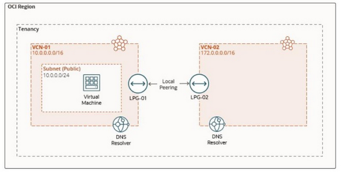

# Lab 05: Design and Implement a Real-Network Architecture: Configuring private DNS Zones, views, resolvers, listeners and forwarders

## Overview

Customers want to specify their own private DNS domain names to manage their private assets in OCI, as well as support DNS resolution between VCNs and between VCNs and on-premises networks. With private DNS, customers can:

- Create private DNS zones with their desired names and create records for their private resources.
- Create a private DNS resolver for DNS resolution to and from other private networks.
- Resolve queries for custom private zones and system-generated zones, such as oraclevcn.com.
- See DNS views and implement conditional forwarding for split-horizon environments.



In this lab, you'll:

1. Create custom private zones.
1. Configure a VCN resolver
1. Configure the VCN resolver to add the other private view

## Execution

Run the following commands:

```bash
terraform init -reconfigure
terraform apply -auto-approve
```

This will fail with the following error message:

```text
╷
│ Error: Missing required argument
│ 
│   with oci_dns_resolver_endpoint.LAB05_VCN02_LISTENER,
│   on allow_dns_queries.tf line 48, in resource "oci_dns_resolver_endpoint" "LAB05_VCN02_LISTENER":
│   48: 	resolver_id                 = data.oci_core_vcn_dns_resolver_association.IAD-NP-LAB05-VCN-02-RESOLVER.dns_resolver_id
│ 
│ The argument "resolver_id" is required, but no definition was found.
╵
```

Wait a few minutes, then re-issue the following command.  The reason is that OCI takes some time to create the DNS resolver which is not managed by Terraform:

```bash
terraform apply -auto-approve
```

```bash
./setup_ssh.sh
```

## Testing

Use the following command to test the configuration

```bash
./validate_setup.sh 
```

Sample session is:

```text
Testing from VM01

Pseudo-terminal will not be allocated because stdin is not a terminal.
Warning: Permanently added '150.230.166.162' (ED25519) to the list of known hosts.
Activate the web console with: systemctl enable --now cockpit.socket

server01.zone-a.local has address 10.0.0.2
zone-a.local name server vcn-dns.oraclevcn.com.
zone-a.local has SOA record vcn-dns.oraclevcn.com. hostmaster.oracle.com. 2 3600 3600 3600 10
server01.zone-b.local has address 172.16.0.123
```
