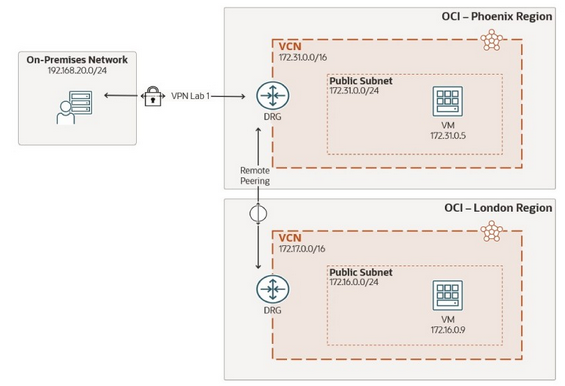

# Lab 07: Remote Peering: InterConnect OCI resources between regions and extend to on-premises

## Overview

> A Dynamic Routing Gateway (DRG) is an OCI virtual router. It provides a path for traffic between on-premises networks and Virtaul Cloud Networks via Site-to-site VPN, or via FastConnect. DRGs are also used for routing traffic between VCNs that are located within the same region, remote regions, and/or in other OCI accounts (tenancies). Using different types of attachmennts, custom network topologies can be constructed using components in different regions and tenancies. Each DRG attachment has an associated route table which is used to route packets entering the DRG to their next hop.
>
> A DRG can have multiple network atatchments of each of the following types:
>
> - __VCN attachments__: you can attach mutiple VCNs to a single DRG. Each VCN can be in the same or different tenancies as the DRG.
> - __RPC attachments__: you can peer a DRG to other DRGs (including DRGs in other regions) using remote peering connections.
> - __IPSEC_TUNNEL attachments__: you can use Site-to-site VPN to attach two or more IPSec tunnels to your DRG to connect to on-premises networks. This is also allowed across tenancies.
> - __VIRTUAL_CIRCUIT attachments__: you can attach one or more FastConnect virtual circuits to your DRG to connect to on-premises networks.
>
> In the following practices, you will configure the dynamic routing gateway created in Lab One in the Phoenix region to connect to resources in a third region, UK South (london), via OCI's remote peering connection. Once this is successfully configured, the DRG in Phoenix will be configured to route traffic from on-premises to London, extending the existing on-premises to OCI site-to-site VPN reach.
>
> 
>
> In this lab, you'll:
>
> 1. Create the required remote peering resources in the UK South region.
> 1. Configure a dynamic routing gateway for remote peering.
> 1. Route from on-premises to the remote region.
