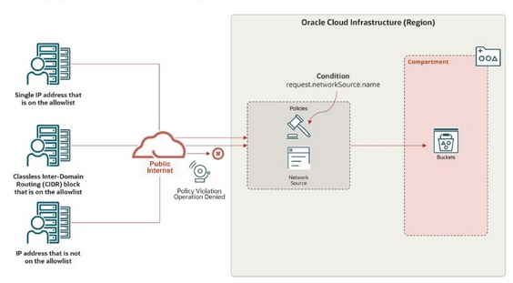

# Lab 08: Infrastructure Security - Network: Create a Network Source to Restrict Access to Object Storage Service

## Overview

> A network source allows you to specify the IP addresses that are allowed. Then, in your policy, include a condition that only allows access from IP addresses specified in your network source. When a policy specifies it, IAM verifies that a request to access a resource comes from an allowed IP address.
>
> For example, you can restrict access to Object Storage buckets in your compartment to only users who are signed in to Oracle Cloud Infrastructure through your corporate network. Similarly, you can restrict access requests from specific VCN subnets.
>
> 

## Implementation

### Import Network Sources Resource

Since the Network Source, "IAD-NP-LAB08-1-NS-01", already exists, the resource needs to be imported as follows:

```bash
eval $(sed -nre '/^tenancy=/p' .oci/config)
ns_id=$(oci iam network-sources list --compartment-id ${tenancy} --name "IAD-NP-LAB08-1-NS-01" --query 'data[0].id' --raw-output)
terraform import oci_identity_network_source.IAD-NP-LAB08-NS-01 ${ns_id}
```

After about two (2) seconds, the following message should be seen:

```text
Import successful!

The resources that were imported are shown above. These resources are now in
your Terraform state and will henceforth be managed by Terraform.
```
