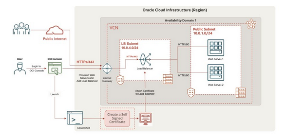

# Lab 09: Instrastructure Security - Network: Create a Self-Signed Certificate and Perform SSL Termination on OCI Load Balancer

## Overview

> In this practice, you will deploy web servers on two compute instances in Oracle Cloud Infrastructure (OCI, configured in High Availability mode by using a load balancer; create a Self-Signed Certificate; create an OCI Load Balancer with SSL termination configuration; and test the SSL Termination at OCI Load Balancer.
>
> Most web servers provide a secure socket layer (SSL) connection so that all communication is encrypted. An SSL connection uses a certificate to encrypt data sent between a web browser and a web server. However, the decryption process requires more computation power on the web server. SSL termination, also known as SSL offloading, helps in the SSL decryption process at the OCI Load Balancer and reduces the load on the web server. After SSL termination at the OCI Load Balancer, unencrypted traffic is routed to web server over the OCI network.
>
> In this lab, you will:
>
> 1. Create a Virtual Cloud Network
> 1. Create a compute instance and install a web server
> 1. Create a security list and an additional Load Balancer Subnet
> 1. Create a load balancer with SSL Termination configuration
> 1. Update the security list for the Load Balancer Subnet
> 1. Test SSL Termination (SSL Offloading) at OCI Load Balancer
>
> 
