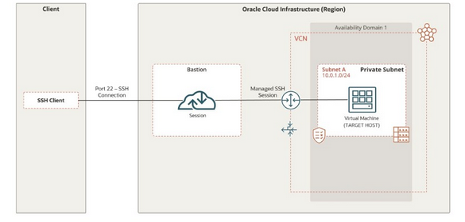

# Lab 10: Infrastructure Security - Compute: Set Up a Bastion Host

## Overview

> Oracle Cloud Infrastructure (OCI) Bastion restricts and limits access to target resources that do not have public endpoints. Bastions enable authorised users to connect to target resources via Secure Shell (SSH) sessions from certain IP addresses. Targets can include resources auch as compute instances, DB systems, and Autonomous Database for Transaction Processing and Mixed Workloads databases. Bastions provide an extra layer of security through the configuration of CIDR block allowlists specify what IP addresses or IP address ranges can connect to a session hosted by the bastion.
>
> In this lab, you'll:
>
> 1. Create and configure a Virtual Cloud Network
> 1. Enable Bastion plug-in on a compute instance
> 1. Create a Bastion
> 1. Create a Bastion session
> 1. Connect to a compute instance using a managed SSH session
>
> 
