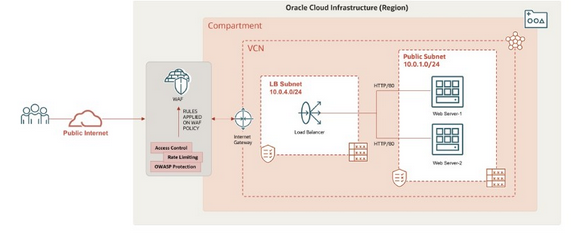

# Lab 11: Application Security: Create and Configure Web Access Firewall

> OCI WAF is a cloud-based security service that aids in the protection of your web applications against malicious and unwanted Internet traffic. It employs a multilayered approach to help safeguard web applications against a variety of cyber threats such as malicious bots, application layer (L7) DDOS attacks, cross-site scripting, SQL injection, and other vulnerabilities defined by the Open Web Application Security Project (OWASP). It can protect any Internet-facing endpoint by enforcing consistent rules across applications and filtering out malicious requests to your web application.
>
> ## Overview
>
> In this lab, you will:
>
> 1. Create a Virtual Cloud Network
> 1. Create a compute instance and install the web server
> 1. Create a security list and an additional Load Balanacer Subnet
> 1. Create a Load Balancer and update the security list
> 1. Create a Web Application Firewall policy
> 1. Configure Rate Limiter and verofy
> 1. Configure Protections and verify XSS attack
> 1. Configure access control and verify conditions
>
> 

## Implementation

Run the following commands to set up the lab environment for the first two (2) tests:

```bash
cd terraform/Lab_11_Application_Security
terraform init
terraform apply -auto-approve
rm -fr .ssh
./install_and_configure_web_server.sh
```

### Rate Limiting Test

The first test is to limit the page request rate through the load balancer to a maximum of three (3) requests in a period of five (5) seconds:

```bash
lb_public_ip=$(terraform output -raw lb_public_ip)
for i in {1..10}
do
    curl http://${lb_public_ip}
done
```

The expected output is:

```text
You are visiting Web Server 1
You are visiting Web Server 1
You are visiting Web Server 1
You are visiting Web Server 1
Too many requests are being sent to Web Server-1.
Too many requests are being sent to Web Server-1.
Too many requests are being sent to Web Server-1.
Too many requests are being sent to Web Server-1.
Too many requests are being sent to Web Server-1.
Too many requests are being sent to Web Server-1.
```

## Protection Rule to Prevent XSS Attack

The second test is block cross-site scripting by trying to insert a Javascript call:

```bash
lb_public_ip=$(terraform output -raw lb_public_ip)
curl "http://${lb_public_ip}/index.html?%3Cp%20style=%22background:url(javascript:alert(1))%22%3E"
```

The expected output is:

```text
Service Unavailable; web Server is secured against XSS attacks.
```

## Access Control Rule

This test overrides the above two (2) tests by checking the country of origin. The following commands are used to change the checking country of origin from Antarticia (AY) to Australis (AU):

```bash
sed -i -re '/^country/s!AY!AU!' ../common/terraform.tfvars
terraform apply -auto-approve
```

To test blocking of requests from Australia, run the following commands:

```bash
lb_public_ip=$(terraform output -raw lb_public_ip)
curl http://${lb_public_ip} 
```

The expected output is:

```text
Service Unavailable: the web server cannot be accessed by the requested source region.
```
